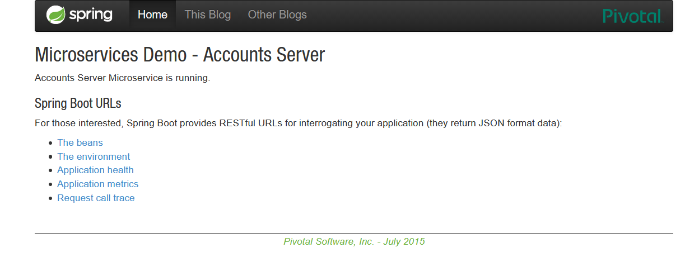
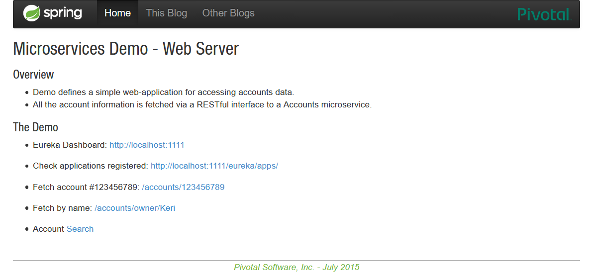
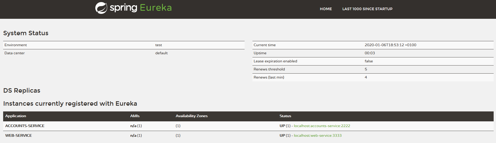
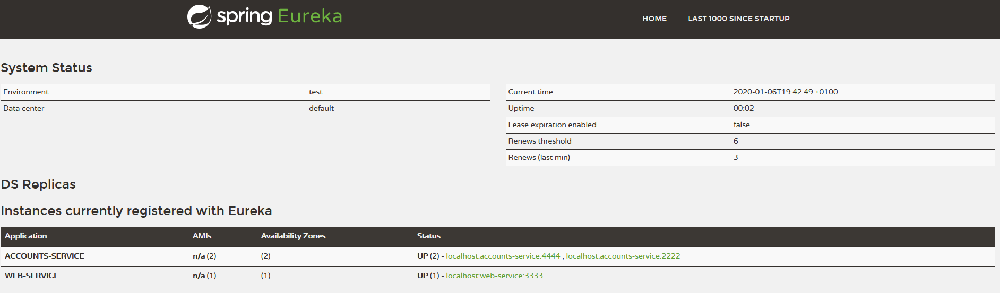
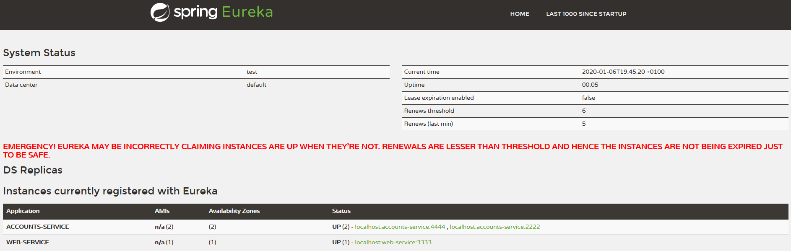
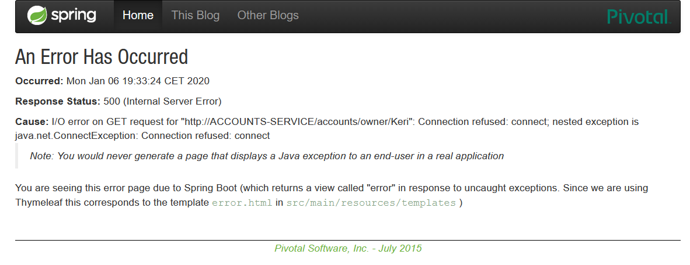

# lab6-microservices Report

* Naval Alcalá (739274@unizar.es)

## Testing microservices life

In order to check that the microservices are working, **traces** of their execution have been obtained and verified, and then it has been verified that they have been correctly registered in Eureka.

### Accounts microservice

* Trace

```
2020-01-06 19:40:59.689  INFO 3080 --- [           main] o.s.c.n.e.s.EurekaServiceRegistry        : Registering application ACCOUNTS-SERVICE with eureka with status UP
2020-01-06 19:40:59.689  INFO 3080 --- [           main] com.netflix.discovery.DiscoveryClient    : Saw local status change event StatusChangeEvent [timestamp=1578336059689, current=UP, previous=STARTING]
2020-01-06 19:40:59.691  INFO 3080 --- [nfoReplicator-0] com.netflix.discovery.DiscoveryClient    : DiscoveryClient_ACCOUNTS-SERVICE/localhost:accounts-service:2222: registering service...
2020-01-06 19:40:59.724  INFO 3080 --- [           main] o.s.b.w.embedded.tomcat.TomcatWebServer  : Tomcat started on port(s): 2222 (http) with context path ''
2020-01-06 19:40:59.724  INFO 3080 --- [           main] .s.c.n.e.s.EurekaAutoServiceRegistration : Updating port to 2222
2020-01-06 19:40:59.725  INFO 3080 --- [           main] accounts.AccountsServer                  : Started AccountsServer in 10.335 seconds (JVM running for 10.681)
2020-01-06 19:40:59.786  INFO 3080 --- [nfoReplicator-0] com.netflix.discovery.DiscoveryClient    : DiscoveryClient_ACCOUNTS-SERVICE/localhost:accounts-service:2222 - registration status: 204
<=========----> 75% EXECUTING [13s]
> :accounts:bootRun
```
* Web Service screenshot



### Web microservice

* Trace

```
2020-01-06 19:41:32.366  INFO 7060 --- [           main] o.s.c.n.e.s.EurekaServiceRegistry        : Registering application WEB-SERVICE with eureka with status UP
2020-01-06 19:41:32.366  INFO 7060 --- [           main] com.netflix.discovery.DiscoveryClient    : Saw local status change event StatusChangeEvent [timestamp=1578336092366, current=UP, previous=STARTING]
2020-01-06 19:41:32.367  INFO 7060 --- [nfoReplicator-0] com.netflix.discovery.DiscoveryClient    : DiscoveryClient_WEB-SERVICE/localhost:web-service:3333: registering service...
2020-01-06 19:41:32.402  INFO 7060 --- [nfoReplicator-0] com.netflix.discovery.DiscoveryClient    : DiscoveryClient_WEB-SERVICE/localhost:web-service:3333 - registration status: 204
2020-01-06 19:41:32.407  INFO 7060 --- [           main] o.s.b.w.embedded.tomcat.TomcatWebServer  : Tomcat started on port(s): 3333 (http) with context path ''
2020-01-06 19:41:32.407  INFO 7060 --- [           main] .s.c.n.e.s.EurekaAutoServiceRegistration : Updating port to 3333
2020-01-06 19:41:32.408  INFO 7060 --- [           main] web.WebServer                            : Started WebServer in 8.401 seconds (JVM running for 8.725)
<=========----> 75% EXECUTING [14s]
> :web:bootRun
```
* Web Service screenshot



### Register microservice

* Trace

As you can see, the microservices are correctly incorporated into the registry:

```
2020-01-06 19:40:13.758  INFO 24416 --- [      Thread-11] c.n.e.r.PeerAwareInstanceRegistryImpl    : Changing status to UP
2020-01-06 19:40:13.765  INFO 24416 --- [      Thread-11] e.s.EurekaServerInitializerConfiguration : Started Eureka Server
2020-01-06 19:40:13.777  INFO 24416 --- [           main] o.s.b.w.embedded.tomcat.TomcatWebServer  : Tomcat started on port(s): 1111 (http) with context path ''
2020-01-06 19:40:13.777  INFO 24416 --- [           main] .s.c.n.e.s.EurekaAutoServiceRegistration : Updating port to 1111
2020-01-06 19:40:13.778  INFO 24416 --- [           main] registration.RegistrationServer          : Started RegistrationServer in 8.228 seconds (JVM running for 8.571)
2020-01-06 19:40:14.759  INFO 24416 --- [a-EvictionTimer] c.n.e.registry.AbstractInstanceRegistry  : Running the evict task with compensationTime 0ms
...
2020-01-06 19:40:59.615  INFO 24416 --- [nio-1111-exec-1] o.a.c.c.C.[Tomcat].[localhost].[/]       : Initializing Spring DispatcherServlet 'dispatcherServlet'
2020-01-06 19:40:59.615  INFO 24416 --- [nio-1111-exec-1] o.s.web.servlet.DispatcherServlet        : Initializing Servlet 'dispatcherServlet'
2020-01-06 19:40:59.619  INFO 24416 --- [nio-1111-exec-1] o.s.web.servlet.DispatcherServlet        : Completed initialization in 4 ms
2020-01-06 19:40:59.781  INFO 24416 --- [a-EvictionTimer] c.n.e.registry.AbstractInstanceRegistry  : Running the evict task with compensationTime 0ms
2020-01-06 19:40:59.785  INFO 24416 --- [nio-1111-exec-2] c.n.e.registry.AbstractInstanceRegistry  : Registered instance ACCOUNTS-SERVICE/localhost:accounts-service:2222 with status UP (replication=false)
2020-01-06 19:41:00.782  INFO 24416 --- [a-EvictionTimer] c.n.e.registry.AbstractInstanceRegistry  : Running the evict task with compensationTime 0ms
2020-01-06 19:41:01.782  INFO 24416 --- [a-EvictionTimer] c.n.e.registry.AbstractInstanceRegistry  : Running the evict task with compensationTime 0ms
...
2020-01-06 19:41:32.401  INFO 24416 --- [nio-1111-exec-6] c.n.e.registry.AbstractInstanceRegistry  : Registered instance WEB-SERVICE/localhost:web-service:3333 with status UP (replication=false)
2020-01-06 19:41:32.794  INFO 24416 --- [a-EvictionTimer] c.n.e.registry.AbstractInstanceRegistry  : Running the evict task with compensationTime 0ms
```
* Web Service screenshot

In the section 'Instances currently registered with Eureka' appears with **UP** status the ACCOUNTS-SERVICE and WEB-SERVICE



## Starting new accounts microservice

While running the previously launched account microservice, the file ```\src\main\resources\application.yml``` is modified by changing Tomcat's HTTP port to 4444.
Another instance of this microservice is executed to be incorporated into the system as a mirror.

* Trace

In the Eureka register trace you can check how this new microservice is correctly incorporated.

```
2020-01-06 19:42:19.721  INFO 9108 --- [nio-1111-exec-4] c.n.e.registry.AbstractInstanceRegistry  : Registered instance ACCOUNTS-SERVICE/localhost:accounts-service:4444 with status UP (replication=false)24416 --- [a-EvictionTimer] c.n.e.registry.AbstractInstanceRegistry

```

* Web Service screenshot

You can now see that the ACCOUNTS-SERVICE application has two registered instances:



## Killing original account microservice

Once the execution of the account microservice that was running on port 2222 has been stopped, you can see how a few seconds later the Eureka service detects an anomaly:



This is indicating that despite not having completely ruled out the existence of the stopped microservice, you may not be able to operate with it.
After attempting to access the Keri user account data from the web microservice, an error 500 is displayed. This will be resolved in subsequent access attempts.




You can see how the new accounts microservice shows the access:

```
2020-01-06 20:33:45.902  INFO 19368 --- [nio-4444-exec-4] accounts.web.AccountsController          : accounts-service byOwner() found: [123456789 [Keri Lee]: $81719.52]
```